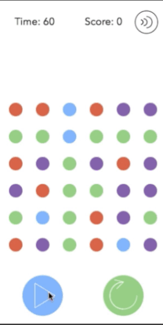

Dots

[Dots Live][dots]

[dots]: https://victorguillen.github.io/Dots/

Dots is inspired on a game produced by Betaworks and developed at Playdots, Inc.. The player tries to connect as many dots possible of the same color under 60 seconds.




Score

Connect dots of the same color to make points before the timer hits 0.

Player Statistics

The following stats are tracked during play:

"Time" - Keeps track of the time elapsed.

"Score" - Keeps tracks of the total amount of dots connected.

Play Features

The following features are available during play during play:

"Play" - Allows the user to starts the game.

"Pause" - Allows the user to pauses the game.

"Restart" -Allows the user to restart the game.

"Mute" -Allows the user to turn sound effects off.

Game Play

On each rendering of the canvas, dots are iterated through and click event listener animations get triggered. On the first click of a dot, the dot expands and fades out to show it has been selected, on a consecutive click to a dot of the same color a link animation gets triggered to render a link between dots. If you have connected all the possible dots of the same color, the dots disappear and new dots drop from the top.


Physics of the game

The drop effect is made possible by adding a constant velocity on the x (vx) and y (vy) axis, a negative velocity on the y axis is added to make the dot bounce up once it reaches its end point. The bouncing effect is a combination of negative velocity and gravity. The gravity is implemented by multiplying vy by a negative decimal coefficient, by doing this the velocity in y tends to 0, making the dot come to a complete stop.

```js
class Particle {

  constructor(x, y, i, j) {
    this.x = x;
    this.y = y;
    this.originalX = x;
    this.originalY = y;
    this.i =  i;
    this.j = j;
    this.radius = 12;
    this.fadeRadius = this.radius;
    this.endY = y + 200;
    this.vy = 5;
    this.gravity = 1;
  }
  initBounce(context) {
    this.y += this.vy;
    this.vy += 1;
    if (this.y > this.originalY + 198) {
    }
    if (this.y > this.endY) {
      this.vy *= -.3;
      this.y = this.endY;
    }
    this.vy += this.gravity;
    context.beginPath();
    context.arc(this.x, this.y, this.radius, 0, Math.PI*2, false);
    context.fillStyle = this.color;
    context.fill();
    context.closePath();
  }
}
```
