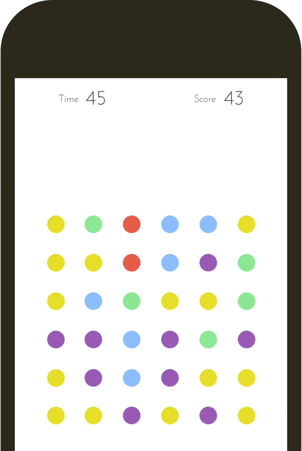

Dots

[Dots Live][dots]

[dots]: https://victorguillen.github.io/Dots/

Dots is inspired on a game produced by Betaworks and developed at Playdots, Inc.. The player tries to connect as many dots possible of the same color under 60 seconds.



Score

Connect dots of the same color to make points before the timer hits 0.

Player Statistics

The following stats are tracked during play:

"Time" - Keeps track of the time elapsed.

"Score" - Keeps tracks of the total amount of dots connected.

Play Features

The following features are available during play during play:

"Play" - Allows the user to starts the game.

"Pause" - Allows the user to pauses the game.

"Restart" -Allows the user to restart the game.

Eliminating dots

On each rendering of the canvas, dots are iterated, through an click event listener animations get triggered. On the first click on a dot the dot expands and fades out to show it has been selected, on a consecutive click to a dot of the same color a link animation gets triggered to render a link between dots. If you have connected all the dots of the same color possible, the dots disappear and get replaced by new dots from the top.

The drop effect is made possible by using velocity and gravity, these two attributes create an effect of bounce when the dots drop, velocity slows down by applying a negative gravity.

```js
class Particle {

  constructor(x, y, i, j) {
    this.x = x;
    this.y = y;
    this.originalX = x;
    this.originalY = y;
    this.i =  i;
    this.j = j;
    this.radius = 12;
    this.fadeRadius = this.radius;
    this.endY = y + 200;
    this.vy = 5;
    this.gravity = 1;
  }
  initBounce(context) {
    this.y += this.vy;
    this.vy += 1;
    if (this.y > this.originalY + 198) {
    }
    if (this.y > this.endY) {
      this.vy *= -.3;
      this.y = this.endY;
    }
    this.vy += this.gravity;
    context.beginPath();
    context.arc(this.x, this.y, this.radius, 0, Math.PI*2, false);
    context.fillStyle = this.color;
    context.fill();
    context.closePath();
  }
}
```

Future Additions

I plan to add:

A drop down menu to select different time settings for a longer play time.

A phone frame around the game.
